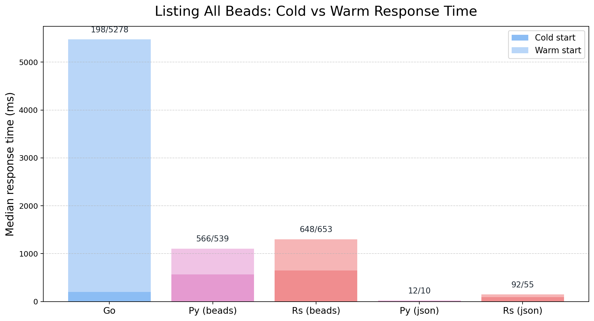

# Kanbus

**A tiny Jira clone for your repo.**


## Inspiration & Lineage

Kanbus is a spiritual successor to [Beads](https://github.com/steveyegge/beads), inspired by its elegant, domain-specific approach to project management. We are deeply grateful to the Beads author and community for proving that a dedicated cognitive framework for tasks is game-changing.

Kanbus builds on this foundation by adapting the model to be a thinner, more native layer over Git—optimizing for AI agents and distributed teams:

*   **A Thinner Layer over Git**: We removed the secondary SQLite index. The complexity of maintaining and synchronizing a shadow database isn't worth the operational cost. Kanbus reads files directly.
*   **Better Storage Alignment**: Things like "exclusively claiming" a task don't align well with the distributed Git model. We removed them to ensure the tool behaves exactly like the version control system underneath it.
*   **Conflict-Free Storage**: Instead of a single JSON-L file (which guarantees merge conflicts when agents work in parallel), Kanbus stores separate tasks in separate files. This eliminates conflicts and allows deep linking to specific issues from GitHub.
*   **Streamlined Cognitive Model**: Beads is powerful but complex, with 130+ attributes per issue. We streamlined this to a focused core (Status, Priority, Dependencies) to reduce the "context pollution" for AI agents. We want the model to think about the work, not how to use the tracker. The goal is a **helpful cognitive model** that unburdens your mental state rather than adding to it.
*   **AI-Native Nomenclature**: Instead of teaching models new terms like "beads", we use the standard Jira vocabulary (Epics, Tasks, Sub-tasks) that AI models are already extensively pre-trained on. This leverages their existing knowledge graph for better reasoning.
*   **Git-Native Scoping**: We replaced complex "contributor roles" with standard Git patterns. Want local tasks? Just `.gitignore` a folder. Working in a monorepo? Kanbus respects your current directory scope automatically.

## Frictionless Workflow

Kanbus is designed to **remove friction**, not add it. 

*   **No Syncing**: There is no secondary database to synchronize. The files on disk are the source of truth. You will never be blocked from pushing code because a background daemon is out of sync.
*   **Git Hooks Help You**: Git hooks should assist your workflow, not interrupt it. Kanbus hooks are designed to be invisible helpers, ensuring data integrity without stopping you from getting work done.

For a detailed comparison, see [Kanbus vs. Beads](docs/VS_BEADS.md).

## Why Kanbus?

### 1. The Sleep Factor
Offload your mental context. Instead of keeping 15 different chat sessions and open loops in your head, tell your agent to "record the current state" into Kanbus. It's a permanent, searchable memory bank for your AI workforce.

### 2. Files are the Database
- **No SQL Server**: We removed the SQLite daemon entirely. Each command reads the JSON files directly, so there is nothing to synchronize or keep running.
- **No JSONL Merge Conflicts**: There is no monolithic JSONL file. Every issue has its own JSON document, which eliminates merge conflicts when teams (or agents) edit work in parallel.
- **No Daemon**: There is no background process to crash or manage.
- **No API**: Your agents read and write files directly (or use the simple CLI).

### 3. Concurrency Solved
Unlike other file-based systems that use a single JSONL file (guaranteeing merge conflicts), Kanbus stores **one issue per file**. This allows multiple agents and developers to work in parallel without blocking each other.

### 4. Jira + Confluence for Agents
Kanbus includes a **Wiki Engine** that renders Markdown templates with live issue data. Your planning documents always reflect the real-time state of the project, giving agents the "forest view" they often lack.

### 5. Zero Cost Footprint
There are no per-seat licenses or hosted fees. If you have a git repository, you already have the database—and that keeps Kanbus affordable for very large teams (or fleets of agents).

---

## Status: Planning Phase

This repository contains the complete vision, implementation plan, and task breakdown for building Kanbus. We are building it in public, using Kanbus to track itself.

## Quick Start

```bash
# Initialize a new project
kanbus init

# Create an issue
kanbus create "Implement the login flow"

# List open tasks
kanbus list --status todo

# Show details
kanbus show kanbus-a1b
```

## Console (Rust backend)

The console UI is served by the Rust local server.

### Quick Start (Prebuilt Binary)

Download the prebuilt binary from [GitHub Releases](https://github.com/AnthusAI/Kanbus/releases):

```bash
# Linux x86_64
curl -L -o kanbus-console.tar.gz https://github.com/AnthusAI/Kanbus/releases/latest/download/kanbus-console-x86_64-unknown-linux-gnu.tar.gz
tar -xzf kanbus-console.tar.gz
chmod +x kanbus-console
./kanbus-console
# Opens web UI at http://127.0.0.1:5174/
```

The binary includes all frontend assets—no configuration or additional files required.

### Development Mode

Run the local backend with filesystem assets:

```bash
cargo run --bin kanbus-console --manifest-path rust/Cargo.toml
```

The development build serves assets from `apps/console/dist/`. Build the frontend once if not already built:

```bash
cd apps/console
npm install
npm run build
```

### Production Binary (Build from Source)

To build a standalone binary with embedded frontend:

```bash
cd apps/console
npm install
npm run build

cd ../rust
cargo build --release --features embed-assets --bin kanbus-console
```

The resulting binary at `rust/target/release/kanbus-console` includes all frontend assets and requires no additional files.

### Usage

Open in browser (local mode):

```
http://127.0.0.1:5174/
```

Or for multi-tenant mode (set `CONSOLE_TENANT_MODE=multi`):

```
http://127.0.0.1:5174/<account>/<project>/
```

### Environment Variables

- `CONSOLE_PORT` (default `5174`)
- `CONSOLE_ROOT` (sets both data root and assets root)
- `CONSOLE_DATA_ROOT` (data root override)
- `CONSOLE_ASSETS_ROOT` (assets root override, takes precedence over embedded assets)
- `CONSOLE_TENANT_MODE=multi` (enable `/account/project` mapping under data root)

**Note**: When using the production binary with `--features embed-assets`, frontend assets are embedded in the binary and served automatically. Setting `CONSOLE_ASSETS_ROOT` will override embedded assets and serve from the filesystem instead.

## Daemon Behavior

Kanbus uses a just-in-time index daemon for read-heavy commands such as `kanbus list`. The CLI auto-starts the daemon when needed, reuses a healthy socket, and removes stale sockets before restarting.

To disable daemon mode for a command:

```bash
KANBUS_NO_DAEMON=1 kanbus list
```

Operational commands:

```bash
kbs daemon-status
kbs daemon-stop
# or: kanbus daemon-status / kanbus daemon-stop
```

## Python vs Rust

Kanbus ships two CLI implementations with identical features. Both run the same behavior specs with full coverage and share interoperability tests (including Beads), so workflows and outputs match exactly. The difference is setup and speed: Python is the lightest install path, while Rust requires a Rust toolchain but runs substantially faster.

**Choose Python if:**
- You want easy `pip install` with no compilation
- You are scripting custom agent workflows

**Choose Rust if:**
- You need maximum performance (sub-millisecond queries)
- You have a massive repository (> 2000 issues)

## Architecture Snapshot

### Language duality
Kanbus keeps Python and Rust in lockstep: both CLIs run the same Gherkin specs, share identical JSON serialization, and target the same operational model. The duality is intentional—pick the runtime that fits your packaging or performance needs without changing workflows.

### File-organization dimension
Storage is single-path and conflict-resistant: every issue lives in its own JSON file under `project/issues/`, with hierarchy and workflow rules in `kanbus.yml`. There is no secondary SQLite cache or fallback location to reconcile, which removes whole classes of sync defects and keeps the mental model aligned with Git.

### Performance benchmark
We benchmarked real data from the Beads project (836 issues) to measure end-to-end “list all beads” latency, including process startup. Scenarios: Beads (Go, SQLite + JSONL), Kanbus Python/Rust reading the Beads JSONL (`--beads`), and Kanbus Python/Rust reading project JSON files. Five runs each with caches cleared between runs.

Key takeaway: direct JSON reads are fast enough that a SQLite sidecar solves a problem we do not have. Removing it simplifies operations, eliminates sync fragility, and keeps deployments portable.


Warm-start median response times (ms): Go 5277.6; Python — Beads JSONL 538.7; Rust — Beads JSONL 9.9; Python — Project JSON 653.5; Rust — Project JSON 54.6.



Cold/Warm medians (ms, cold over warm shown as stacked bars): Go 197.6/5277.6; Python — Beads 566.1/538.7; Rust — Beads 11.9/9.9; Python — JSON 648.3/653.5; Rust — JSON 92.4/54.6. Warm runs reuse the resident daemon for Kanbus; cold runs force `KANBUS_NO_DAEMON=1` and clear caches each iteration. Go/Beads warm path spikes because its SQLite daemon import dominates the second run.

## Project Structure

```
Kanbus/
|-- planning/
|   |-- VISION.md                  # Complete specification
|   `-- IMPLEMENTATION_PLAN.md     # Detailed technical plan
|-- specs/                         # Shared Gherkin feature files
|-- python/                        # Python implementation
|-- rust/                          # Rust implementation
|-- apps/                          # Public website (Gatsby)
`-- .beads/                        # Project task database
```

## Contributing

We welcome contributions! Please:
1. Pick a task from `kanbus ready`.
2. Follow the BDD workflow in [AGENTS.md](AGENTS.md).
3. Ensure all quality gates pass.

## Testing

Run the full quality gates:

```bash
make check-all
```

Run only Python checks:

```bash
make check-python
```

Run only Rust checks:

```bash
make check-rust
```

## Benchmarking

Run index build and cache load benchmarks:

```bash
python tools/benchmark_index.py
cd rust && cargo run --release --bin index_benchmark
```

## License

MIT
